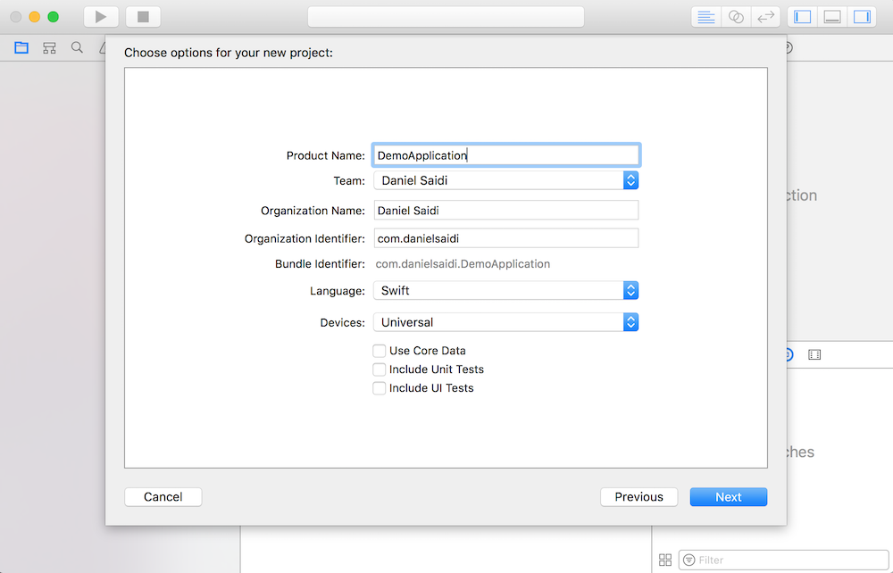

# Alamofire & Realm Demo

This is a step-by-step walkthrough of my talk at **CocoaHeads Sthlm, April 2017**,
where I demonstrated how to use `Alamofire 4` and `AlamofireObjectMapper` to pull
and parse data from an API. I also used `Realm` for seamless database persistency
and a great library called `Dip` to manage dependencies in the app.

In this post, I'll recreate this app from scratch, with some modifications. Since
the Yelp API doesn't let you persist data you pull out from it, I will modify the
setup slightly, to use a static API instead. Read more on this a bit further down.


# Video

You can watch the original presentation [here](https://www.youtube.com/watch?v=LuKehlKoN7o&lc=z22qu35a4xawiriehacdp435fnpjgmq2f54mjmyhi2tw03c010c.1502618893412377).
However, it focuses more on concepts than code, but could be a nice complement to
this more code-oriented post.


# Source Code

I really recommend you to create a blank iOS project and go through all the steps
in this post yourself. However, you can download the complete source code for the
app from [this GitHub repository](https://github.com/danielsaidi/AlamofireRealmDemo).

If you want to run the demo application in the repo, you have to run `pod install`
from the `DemoApplication` folder, then use `DemoApplication.xcworkspace` instead
of `DemoApplication.xcodeproj`. 


# Prerequisites

For this tutorial, you'll need to download and install [Xcode](https://www.google.com/url?sa=t&rct=j&q=&esrc=s&source=web&cd=&cad=rja&uact=8&ved=0ahUKEwi7lP7s--XVAhVmEpoKHcVkBzUQ0EMIKg&url=https%3A%2F%2Fdeveloper.apple.com%2Fxcode%2Fdownloads%2F&usg=AFQjCNFpOFz2CXarfnUzyEM1Lbia_k7fZw)
from Apple Developer Portal. You also need to [CocoaPods](https://cocoapods.org/),
which is used to manage external dependencies in your app.


# Disclaimer 

In large app projects, I prefer to extract as much code and logic as possible to
separate libraries, which I then use as decoupled building blocks. For instance,
I would keep domain logic in a domain library, which doesn't know anything about
the app. In this small project, however, I will keep the domain model in the app.

I use to separate public and private functions and any interface implementations
into separate extensions as well, but will skip that pattern in this demo, so we
get as little code and conventions as possible. 


# Why use a static API?

In this demo, we will use a static API to fetch movies in two different ways. The
API is just a static Jekyll site with a small movie collection, that lets us grab
top grossing and top rated movies from 2016.

This may seem limited, but will hopefully mean that we can focus more time on the
specific features of Alamofire and Realm instead of understanding an external API
and having to set up a developer account, get authorization up and working etc. I 
hope you can look past these limitations, as you take your newfound knowledge out
into the real world.

Ready? Let's go!


# Step 1 - Create a new iOS project

We'll start by creating a new iOS project in `Xcode`. Open Xcode, click `Create a
new Xcode project`, select the `iOS` tab, then select a `Single View Application`.
In this tutorial, I'll name the project `DemoApplication`:



Press `Next` to select where to create your project. You will then have a new iOS
project just waiting to be filled with amazing code.


# Step 2 - Describe the domain model

In this demo, we will fetch movies from a fake API. A `Movie` has some basic info
and a `cast` property that contains `Actor` objects. For simplicity, `Actor` only
has a name and is used to demonstrate recursive mapping.
 
To avoid having an app that is coupled to a specific implementation of the domain
model, let us start by defining this model as protocols. Create a `Domain` folder
in the project root, then add a `Model` sub folder to it and add these two files:

```
// Movie.swift

import Foundation

protocol Movie {
    
    var id: Int { get }
    var name: String { get }
    var year: Int { get }
    var releaseDate: Date { get }
    var grossing: Int { get }
    var rating: Double { get }
    var cast: [Actor] { get }
}
```

```
// Actor.swift

import Foundation

protocol Actor {
    
    var name: String { get }
}
```

As you will see later on, our app will only care about protocols and not specific
implementations. This makes it super easy to switch out which implementations the
app should use. Stay tuned.


# Step 3 - Describe the domain logic

Since we have a static API with no client or user authorization or authentication,
we don't have to start with this. Instead, we can describe how we want the app to
fetch movies.

Add a `Services` sub folder to `Domain` and add this file:

```
// MovieService.swift

import Foundation

typealias MovieResult = (_ movie: Movie?, _ error: Error?) -> ()
typealias MoviesResult = (_ movies: [Movie], _ error: Error?) -> ()


protocol MovieService: class {
    
    func getMovie(id: Int, completion: @escaping MovieResult)
    func getTopGrossingMovies(year: Int, completion: @escaping MoviesResult)
    func getTopRatedMovies(year: Int, completion: @escaping MoviesResult)
}

```

It took me a while to start using `typealias`, but I really like it, and it does
greatly simplify describing async results.

This service tells us that we will be able to get movies asynchronously (well, a
sompletion block implies it, but doesn't *require* the operation to be async) in
two ways. The result data for the two operations will be indentically formatted. 


# Step 4 - Add Alamofire and AlamofireObjectMapper to the project

Before we can add an API-specific implementation to the project, we must add two
so called `pods` to the project. Make sure CocoaPods is properly installed, then
run the following command from the `DemoApplication` folder:

```
pod init
```

This will create a `pod file` in your project root, in which you can specify the
pods the app requires. Make sure that the file looks like this:

```
// Podfile

use_frameworks!

target 'DemoApplication' do
    pod 'Alamofire', '~> 4.0.0'
    pod 'AlamofireObjectMapper', '~> 4.0' 
end
``` 

Now, close this file and run the following Terminal command from the same folder:

```
pod install
```

This makes CocoaPods download the pods and link them to your Xcode project. Once
that is done, close the project, then open `DemoApplication.xcworkspace` instead.


# Step 5 - Create an API-specific domain model

We are now ready to use Alamofire to pull some data from our API. Have a look at
the (very limited) data that can be fetched from it:

* [Single movie by id](http://danielsaidi.com/AlamofireRealmDemo/api/movies/1)
* [Top 10 Grossing Movies 2016](http://danielsaidi.com/AlamofireRealmDemo/api/movies/topGrossing/2016)
* [Top 10 Grossing Movies 2016 - By Rating](http://danielsaidi.com/AlamofireRealmDemo/api/movies/topRated/2016)

Let's create an API-specific implementation of the domain model. Create an `API`
folder in the project root, next to `Domain`, then add a `Model` sub folder and
add these two files:

```
// ApiMovie.swift

import ObjectMapper

class ApiMovie: Movie, Mappable {
    
    required public init?(map: Map) {}
    

    var id = 0
    var name = ""
    var year = 0
    var releaseDate = Date(timeIntervalSince1970: 0)
    var grossing = 0
    var rating = 0.0
    var cast: [Actor] { return _cast }
    
    private var _cast = [ApiActor]()
    
    
    func mapping(map: Map) {
        id <- map["id"]
        name <- map["name"]
        year <- map["year"]
        releaseDate <- (map["releaseDate"], DateTransform.custom)
        grossing <- map["grossing"]
        rating <- map["rating"]
        _cast <- map["cast"]
    }
}
``` 

```
// ApiActor.swift

import ObjectMapper

class ApiActor: Actor, Mappable {
    
    required public init?(map: Map) {}
    

    var name = ""
    

    func mapping(map: Map) {
        name <- map["name"]
    }
}
``` 

These classes implement their respecive model protocol, with additional property
mapping. `ApiActor` is straightforward, while some can be said about `ApiMovie`:

* The release date is parsed using a DateTransform() instance. We may have to do
tweak this later on (oh, yes we will).

* The `Movie` protocol has an [Actor] array, but the mapping requires [ApiActor].
We therefore use a fileprivate `_cast` mapping property, which we use as backing
value for the calculated `cast` property.

If we have set things up properly, we should now be able to point Alamofire to a
certain api url and recursively parse movie data without any effort.


# Step 6 - Setting the API foundation

Before we create an API-specific `MovieService` implementation, let's setup some
utils in the `API` folder.

## Managing API environments

Since we developers often have to switch between different API environments (e.g.
test and production) I use to have an enum where I manage available environments.
We only have one environment in this case, but let's do it anyway:

```
// ApiEnvironment.swift

import Foundation

enum ApiEnvironment: String { case
    
    production = "http://danielsaidi.com/AlamofireRealmDemo/api/"
    
    var url: String {
        return rawValue
    }
}

```

## Managing API routes

With the API environment info in place, we can now list all static API routes of
interest in another enum:

```
// ApiRoute.swift

enum ApiRoute { case
    
    movie(id: Int),
    topGrossingMovies(year: Int),
    topRatedMovies(year: Int)
    
    var path: String {
        switch self {
        case .movie(let id): return "movies/\(id)"
        case .topGrossingMovies(let year): return "movies/topGrossing/\(year)"
        case .topRatedMovies(let year): return "movies/topRated/\(year)"
        }
    }
    
    func url(for environment: ApiEnvironment) -> String {
        return "\(environment.url)/\(path)"
    }
}
```

Since `year` is a dynamic part of the API movie paths, we add a year argument to
the movie enum cases as well.

## Managing API context

I use to have an API context that holds all API-specific information for the app,
such as target environment and auth tokens. If you use a context singleton in an
app, it is super easy to change its information and have it automatically affect
all API-based services in the app.

Let's create an `ApiContext` protocol, as well as a non-persisted implementation,
in a new `Context` sub folder in the `Api` folder:

```
// ApiContext.swift

import Foundation

protocol ApiContext: class {
    
    var environment: ApiEnvironment { get set }
}
```   

```
// NonPersistedApiContext.swift

import Foundation

class NonPersistentApiContext: ApiContext {
    
    init(environment: ApiEnvironment) {
        self.environment = environment
    }
    
    var environment: ApiEnvironment
}
```

We can now inject this context into all out API-specific service implementations,
as you will see later.

## Specifying basic API behavior

To simplify how to talk with the API using Alamofire, let us create a base class
for our API-based services. Add a `Services` sub folder to the `Api` folder then
add this file to it:

```
// AlamofireService.swift

class AlamofireService {    
    
    init(context: ApiContext) {
        self.context = context
    }
    
    
    var context: ApiContext
    
    
    func get(at route: ApiRoute, params: Parameters? = nil) -> DataRequest {
        return request(at: route, method: .get, params: params, encoding: URLEncoding.default)
    }
    
    func post(at route: ApiRoute, params: Parameters? = nil) -> DataRequest {
        return request(at: route, method: .post, params: params, encoding: JSONEncoding.default)
    }
    
    func put(at route: ApiRoute, params: Parameters? = nil) -> DataRequest {
        return request(at: route, method: .put, params: params, encoding: JSONEncoding.default)
    }
    
    func request(at route: ApiRoute, method: HTTPMethod, params: Parameters?, encoding: ParameterEncoding) -> DataRequest {
        let url = route.url(for: context.environment)
        return Alamofire.request(url, method: method, parameters: params, encoding: encoding).validate()
    }
}
``` 

Restricting our services to requests that are specified in `ApiRoute` will ensure
that the app doesn't make any unspecified requests, which increases the stability,
and testability of the app. In you really need to call custom URLs, I suggest you
add a `.custom(...)` case in the `ApiRoute` enum. 

Ok, that was a nice long preparation phase mainly aimed at setting up a good base
for the future. I think we're now ready to fetch some movies from the API.


# Step 7 - Creating an API-specific movie service

Now, finally, let's create an API-specific service and pull some data out of that
API, shall we? In the `Api/Services` folder, add this file:

```
import Alamofire
import AlamofireObjectMapper

class AlamofireMovieService: AlamofireService, MovieService {
    
    func getMovie(id: Int, completion: @escaping MovieResult) {
        get(at: .movie(id: id)).responseObject {
            (res: DataResponse<ApiMovie>) in
            completion(res.result.value, res.result.error)
        }
    }
    
    func getTopGrossingMovies(year: Int, completion: @escaping MoviesResult) {
        get(at: .topGrossingMovies(year: year)).responseArray {
            (res: DataResponse<[ApiMovie]>) in
            completion(res.result.value ?? [], res.result.error)
        }
    }
    
    func getTopRatedMovies(year: Int, completion: @escaping MoviesResult) {
        get(at: .topRatedMovies(year: year)).responseArray {
            (res: DataResponse<[ApiMovie]>) in
            completion(res.result.value ?? [], res.result.error)
        }
    }
}
```

As you can see, the implementation is super-simple. Just perform get requests on
the routes and specify the return type, then Alamofire and AlamofireObjectMapper
will automatically take care of fetching and mapping the returned data.

Note that `getMovie` uses `responseObject` to specify return type, while the two
other functions use `responseArray`. This is due to the fact that a single movie
is returned as an object while top grossing and top rated movies are returned as
an array. If these two arrays would be returned in an embedded object instead (a
very common case), you would have to specify a new API-specific mapping type and
use `responseObject` instead.


# Step 8 - Perform your very first request

We will now setup the demo application and use it to perform our very first data
request from the API.

First, remove all boilerplate code from `AppDelegate` and `ViewController`, then
add the following code to `ViewController`:

```
override func viewDidLoad() {
    super.viewDidLoad()
    let env = ApiEnvironment.production
    let context = NonPersistentApiContext(environment: env)
    let service = AlamofireMovieService(context: context)
    service.getTopGrossingMovies(year: 2016) { (movies, error) in
        if let error = error {
            return print(error.localizedDescription)
        }
        print("Found \(movies.count) movies:")
        movies.forEach { print("   \($0.name)") }
    }
}
```

**IMPORTANT** Before you can test this in your app, you have to allow the app to
perform external API requests. To do this, just add this `Info.plist` (in a real
world app, though, you should specify the exact domains that the app can access):

```
<key>NSAppTransportSecurity</key>
<dict>
    <key>NSAllowsArbitraryLoads</key>
    <true/>
</dict>
```

Now, run the app. If everything is properly setup, it should print the following:

```
Found 10 movies:
   Finding Dory
   Rouge One - A Star Wars Story
   Captain America - Civil War
   The Secret Life of Pets
   The Jungle Book
   Deadpool
   Zootopia
   Batman v Superman - Dawn of Justice
   Suicide Squad
   Doctor Strange
```

If you see this in your log, then nice! This means that our app loads movie data
from the remove API. Good job! 

Now, change the print for each movie to look like this:

```
movies.forEach { print("   \($0.name) (\($0.releaseDate))") }
```

Ooooops! The app should not output the following:

```
Found 10 movies:
   Finding Dory (1970-01-01 00:33:36 +0000)
   Rouge One - A Star Wars Story (1970-01-01 00:33:36 +0000)
   Captain America - Civil War (1970-01-01 00:33:36 +0000)
   The Secret Life of Pets (1970-01-01 00:33:36 +0000)
   The Jungle Book (1970-01-01 00:33:36 +0000)
   Deadpool (1970-01-01 00:33:36 +0000)
   Zootopia (1970-01-01 00:33:36 +0000)
   Batman v Superman - Dawn of Justice (1970-01-01 00:33:36 +0000)
   Suicide Squad (1970-01-01 00:33:36 +0000)
   Doctor Strange (1970-01-01 00:33:36 +0000)
```

Seems like the date parser does not work as expected (I TOLD you we would return
to this later!) - let's fix it.


# Step 9 - Fix the date parsing

The problem with the dates is that the API uses a different date format than the
format that `ObjectMapper` expects. We can solve this by adding an extension for
`ObjectMapper`'s `DateTransform` class. Add this file to `Api/Extensions`:

```
DateTransform_Custom.swift

//
//  DateTransform_Custom.swift
//  BBDomain
//
//  Created by Saidi Daniel (BookBeat) on 2017-05-08.
//  Copyright © 2017 BookBeat. All rights reserved.
//

import ObjectMapper

public extension DateTransform {
    
    public static var custom: DateFormatterTransform {
        let formatter = DateFormatter()
        formatter.dateFormat = "yyyy-MM-dd"
        formatter.timeZone = TimeZone(secondsFromGMT: 0)
        return DateFormatterTransform(dateFormatter: formatter)
    }
}
```

Then change the `releaseDate` mapping in `ApiMovie` to look like this:

```
releaseDate <- (map["releaseDate"], DateTransform.custom)
```

Now run the app once more. The dates in the print should now look a lot better:

```
Found 10 movies:
   Finding Dory (2016-06-17 00:00:00 +0000)
   Rouge One - A Star Wars Story (2016-12-16 00:00:00 +0000)
   Captain America - Civil War (2016-05-06 00:00:00 +0000)
   The Secret Life of Pets (2016-07-08 00:00:00 +0000)
   The Jungle Book (2016-04-15 00:00:00 +0000)
   Deadpool (2016-02-12 00:00:00 +0000)
   Zootopia (2016-03-04 00:00:00 +0000)
   Batman v Superman - Dawn of Justice (2016-03-25 00:00:00 +0000)
   Suicide Squad (2016-08-05 00:00:00 +0000)
   Doctor Strange (2016-11-05 00:00:00 +0000)
```

If you inspect the other properties, you will see that they are correctly parsed.

Time to celebrate! Grab something to drink, go for a walk, rest your eyes...then
return here for the next step: persisting the API service response to a database.


# Step 10 - Add Realm support

I will go through this in one single run, instead of breaking it up in different
sections. Create a `Realm` folder in the application root then add a `Model` and
a `Services` folder to it.

Before we can use Realm, we have to grab it from CocoaPods. Add the following to
your podfile:

```
pod 'RealmSwift'
```

**IMPORTANT** To make Realm work, you must also add this to the end of the file:

```
post_install do |installer|
    installer.pods_project.targets.each do |target|
        target.build_configurations.each do |config|
            config.build_settings['SWIFT_VERSION'] = '3.0'
        end
    end
end
```

Then run `pod install` from the DemoApplication folder to install it to your app.

Now let's create Realm-specific implementations of the domain model. The classes
will be either be created by Realm when loading them from the database, or as we
persist data that we receive from the API.

Due to this, we want to be able to create instances by mapping properties from a
seconds object that implements the same protocol.

Add these two files to the `Realm/Model` folder:

```
// RealmMovie.swift

import RealmSwift

class RealmMovie: Object, Movie {
    
    convenience required public init(copy obj: Movie) {
        self.init()
        id = obj.id
        name = obj.name
        year = obj.year
        releaseDate = obj.releaseDate
        grossing = obj.grossing
        rating = obj.rating
        _cast.append(contentsOf: obj.cast.map { RealmActor(copy: $0) })
    }
    

    dynamic var id = 0
    dynamic var name = ""
    dynamic var year = 0
    dynamic var releaseDate = Date(timeIntervalSince1970: 0)
    dynamic var grossing = 0
    dynamic var rating = 0.0
    var cast: [Actor] { return Array(_cast) }
    
    var _cast = List<RealmActor>()


    override class func primaryKey() -> String? {
        return "id"
    }
}
```

```
// RealmActor.swift

import RealmSwift

class RealmActor: Object, Actor {
    
    convenience required public init(copy obj: Actor) {
        self.init()
        name = obj.name
    }
    

    dynamic var name = ""
    

    override class func primaryKey() -> String? {
        return "name"
    }
}
```

Once again, `RealmActor` is pretty straightforward while `RealmMovie` needs some
explaining. Just like `ApiMovie`, it has a private `_cast` mapping property that
is used as backing value for the calculated `cast` property.

Now let's add a Realm-specific `MovieService` implementation, that lets us store
movie data from the API to a Realm database.

Add the following file to the `Realm/Services` folder, then scroll down and read
about how it's designed:

```
// RealmMovieService.swift


class RealmMovieService: MovieService {
    
    init(baseService: MovieService) {
        self.baseService = baseService
    }
    
    
    fileprivate let baseService: MovieService
    
    fileprivate var realm: Realm { return try! Realm() }
    
    
    func getMovie(id: Int, completion: @escaping MovieResult) {
        getMovieFromDb(id: id, completion: completion)
        getMovieFromService(id: id, completion: completion)
    }
    
    func getTopGrossingMovies(year: Int, completion: @escaping MoviesResult) {
        getTopGrossingMoviesFromDb(year: year, completion: completion)
        getTopGrossingMoviesFromService(year: year, completion: completion)
    }
    
    func getTopRatedMovies(year: Int, completion: @escaping MoviesResult) {
        getTopRatedMoviesFromDb(year: year, completion: completion)
        getTopRatedMoviesFromService(year: year, completion: completion)
    }
    
    
    fileprivate func getMovieFromDb(id: Int, completion: @escaping MovieResult) {
        let obj = realm.object(ofType: RealmMovie.self, forPrimaryKey: id)
        completion(obj, nil)
    }
    
    fileprivate func getMovieFromService(id: Int, completion: @escaping MovieResult) {
        baseService.getMovie(id: id) { (movie, error) in
            self.persist(movie)
            completion(movie, error)
        }
    }
    
    fileprivate func getTopGrossingMoviesFromDb(year: Int, completion: @escaping MoviesResult) {
        let objs = realm.objects(RealmMovie.self)
        let filtered = objs.filter("year = '\(year)'")
        let sorted = filtered.sorted { $0.grossing > $1.grossing }
        completion(Array(sorted), nil)
    }
    
    fileprivate func getTopGrossingMoviesFromService(year: Int, completion: @escaping MoviesResult) {
        baseService.getTopGrossingMovies(year: year) {  (movies, error) in
            self.persist(movies)
            completion(movies, error)
        }
    }
    
    fileprivate func getTopRatedMoviesFromDb(year: Int, completion: @escaping MoviesResult) {
        let objs = realm.objects(RealmMovie.self)
        let filtered = objs.filter("year = '\(year)'")
        let sorted = filtered.sorted { $0.rating > $1.rating }
        completion(Array(sorted), nil)
    }
    
    fileprivate func getTopRatedMoviesFromService(year: Int, completion: @escaping MoviesResult) {
        baseService.getTopRatedMovies(year: year) {  (movies, error) in
            self.persist(movies)
            completion(movies, error)
        }
    }
    
    fileprivate func persist(_ movie: Movie?) {
        guard let movie = movie else { return }
        persist([movie])
    }
    
    fileprivate func persist(_ movies: [Movie]) {
        let objs = movies.map { RealmMovie(copy: $0) }
        try! realm.write {
            realm.add(objs, update: true)
        }
    }
}
```

`RealmMovieService` is a so called `decorator`, which uses a base implementation
of the protocol that itself implements (in this case `MovieService`), and builds
its behavior on top of the base implementation's behavior.

In this case, `baseService` will be an `AlamofireMovieService` instance, but the
`RealmMovieService` does not care about the logic of the base service. It simply
uses it to get some data then applies its own logic to the mix.

In this case, `RealmMovieService` will try to return data from the database, but
at the same time it will also try to fetch data from the base service. When this
base service calls the completion block, it will save any data it receives, then
calls the completion block.

`Disclaimer:` This is an intentional (but bad) design. I will use it to show how
the Realm call will trigger the completion handler once, and how the API service
result will trigger the completion handler once more. In a real application, you
would probably add additional logic to check whether or not to call the API when
you have data in the database etc.

